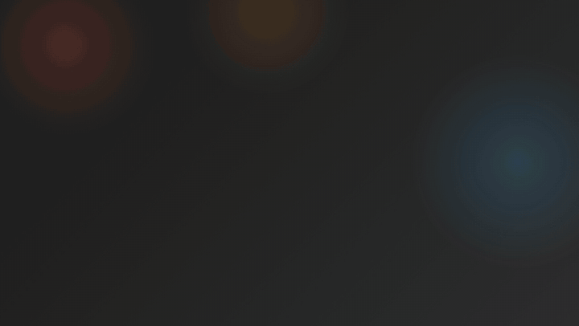

# osiexplain.com

A website I created to assist me in teaching the OSI 7 Layer model to my students.

## Pages

| File | Purpose |
| --- | --- |
| `index.html` | Overview of all seven layers, mnemonics, FAQ and a progress tracker |
| `layer1_physical.html` … `layer7_application.html` | One deep-dive page per layer: interactive demo, Wireshark examples, quiz, FAQ |
| `quiz.html` | 20-question practice exam spanning all seven layers |
| `tcp-ip-vs-osi.html` | Side-by-side comparison with the four-layer TCP/IP model |
| `glossary.html` | ~145 networking terms, filterable and deep-linkable |
| `404.html` | Not-found page (S3 error document) |

Shared assets: `styles.css`, `main.js`, `favicon.svg`, `og-image.svg` / `og-image.png`,
`apple-touch-icon.png`, `robots.txt`, `sitemap.xml`.

`assets/` holds README-only media (e.g. the overview GIF above) and is excluded
from the S3 sync — it ships to GitHub but never to the live site.

## Conventions

- **No build step and no dependencies.** Plain HTML, one stylesheet, one script.
  Open any page straight from disk and it works.
- **`styles.css` is the single source of truth for shared styling.** Page-level
  `<style>` blocks should only hold rules unique to that page — duplicating a
  shared rule there silently overrides the responsive media query at the bottom
  of `styles.css`.
- **`main.js` is progressive enhancement only.** Theme switching, the quiz
  engine, progress tracking and copy buttons all degrade to readable static HTML
  if the script fails or JavaScript is off.
- **Cache busting.** `styles.css` and `main.js` are referenced with a `?v=YYYYMMDD`
  query string. Bump it on every page when either file changes, otherwise S3 and
  browser caches serve the old version.
- **Quizzes** live in the HTML, not in JavaScript, so they are indexable and
  usable without scripting. Markup shape:
  `.quiz[data-quiz-id] > .quiz-list > .quiz-question[data-answer="N"]`, with
  options as `.quiz-options button[data-option="N"]`.
- **Progress** is stored in `localStorage` under `osi:progress` and never leaves
  the browser.
- **Copy buttons** appear on any element carrying a `data-copy` attribute; an
  empty value means "copy my own text content".

## Deployment

Pushing to `main` triggers `.github/workflows/main.yml`, which syncs the
repository to S3 (`--delete`, excluding `.git`, `.github`, `README.md`,
`LICENSE` and `assets/`). Set the bucket's error document to `404.html`.
